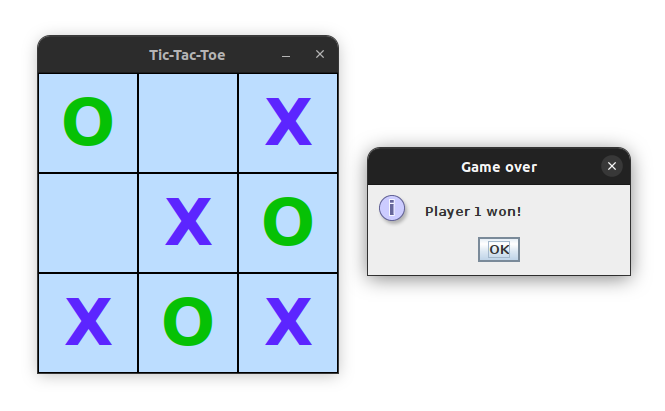

# Tic-Tac-Toe game

A desktop application, a Tic-Tac-Toe game for 2 human players, which I created myself without looking at Tic-Tac-Toe
tutorials.

## Built with

- Java
- Swing

## Screenshot

## Challenge I faced

In my `Cell` class, which extends `JLabel`, at first I created `x` and `y` instance variables, and getter methods.
Turned out, my `getX()` and `getY()` methods overrode the methods in `JComponent`, and it broke my GUI. So I had to
rename my variables to `rowNumber` and `columnNumber`, and rename the getters accordingly to solve the issue.

## Author

- GitHub - [albina0104](https://github.com/albina0104)