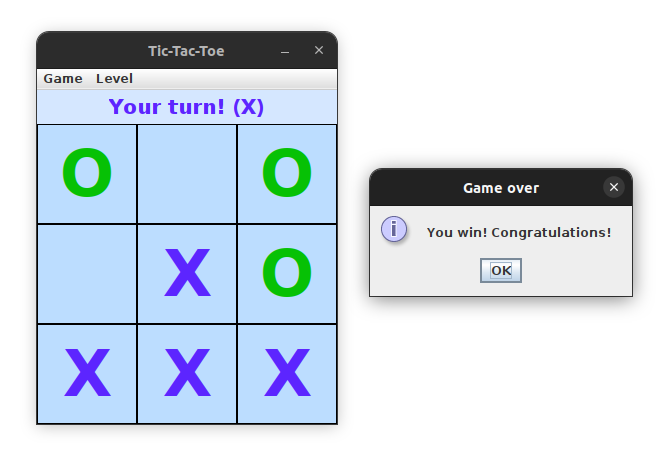

# Tic-Tac-Toe game

A desktop application, a Tic-Tac-Toe game, which I created myself without looking at Tic-Tac-Toe
tutorials.

## Built with

- Java
- Swing

## Game features

- Game vs computer
- Game for 2 human players

Currently, there are 2 levels implemented:

- Beginner level - the computer just makes random moves
- Intermediate level logic:
  1. If the computer can win this turn - it wins
  2. Blocks the player's winning move
  3. Makes a random move

## Screenshot

## Challenges I faced

- In my `Cell` class, which extends `JLabel`, at first I created `x` and `y` instance variables, and getter methods.
Turned out, my `getX()` and `getY()` methods overrode the methods in `JComponent`, and it broke my GUI. So I had to
rename my variables to `rowNumber` and `columnNumber`, and rename the getters accordingly to solve the issue.
- Learned that we cannot use `Thread.sleep()` to make a pause in a Swing application, as it will cause GUI update 
process to freeze in an unpredictable place. Instead, we should use `Timer` functionality provided by the Swing library.

## Author

- GitHub - [albina0104](https://github.com/albina0104)